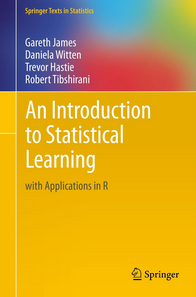

```{r setup, include=FALSE}
library(ggplot2)
library(magrittr)
library(knitr)
library(tidyverse)
library(ISLR)
library(kableExtra)
theme_set(theme_minimal(14))
options(htmltools.dir.version = FALSE)
```

# Ciência de dados


---

# Referências

.pull-left[
<a href = "https://web.stanford.edu/~hastie/ISLRv2_website.pdf">
</img>
</a>
]

.pull-right[
<a href = "https://web.stanford.edu/~hastie/Papers/ESLII.pdf">
</img>
</a>
]


---

# Referências

.pull-left[
<a href = "https://r4ds.had.co.nz/">
</img>
</a>
]

.pull-right[
<a href = "https://www.tmwr.org/">
</img>
</a>
]


---

# Referências

- [Feature Engineering and Selection: A Practical Approach for Predictive Models](http://www.feat.engineering/)

- [Aprendizado De Máquina](http://www.rizbicki.ufscar.br/AME.pdf)

- [Forecasting: Principles and Practice](https://otexts.com/fpp3/)

---

class: middle, center, inverse

# Introdução

---

# O que é Machine Learning?

<br>


- Termo criado por Arthur Samuel, em 1959


- Modelagem preditiva é um framework de análise de dados que visa gerar a estimativa mais precisa possível para uma quantidade ou fenômeno (Max Kuhn, 2014).


---

## Exemplos

.pull-left[

- Previsão de churn

- Previsão de inadimplência

- Previsão de demanda

- Previsão de preço

- Previsão meteorológica

- Diagnóstico em imagem médica

- Carro autônomo

- Projeção da taxa de desemprego
 
]

.pull-right[

- Teste A/B

- Teste clínico

- Eficácia de vacinas

- Impactos de políticas públicas

- Impactos de campanha publicitária

- Curvas epidemiológicas

- Projeção do PIB

- ...

]


 
---

</img>

.footnote[
 fonte: [business2community](https://www.business2community.com/trends-news/10-companies-using-machine-learning-cool-ways-01889944)
]

---

# Motivação

```{r echo=FALSE, include=FALSE}
knitr::opts_chunk$set(
  echo = FALSE, 
  message = FALSE, 
  warning = FALSE,
  fig.width=6, 
  fig.height=6,
  fig.align='center'
)
library(rpart)
adv <- read_csv("static/data/Advertising.csv") %>%
  rename(vendas = sales)
```

Somos consultores e fomos contratados para dar conselhos para uma empresa aumentar as suas vendas.

Obtivemos o seguinte banco de dados

```{r, fig.width = 10, fig.height = 4}
adv_ok <- adv %>% 
  gather(midia, investimento, -vendas)

adv_ok %>% 
  ggplot(aes(x = investimento, y = vendas)) + 
  geom_point() +
  facet_wrap(~midia, scales = "free")
```

* PERGUNTA: Quantas vendas terão se eu investir X? Em qual mídia eu escolho alocar meu orçamento?

---

# Motivação


Somos consultores e fomos contratados para dar conselhos para uma empresa aumentar as suas vendas.

Obtivemos o seguinte banco de dados

```{r, fig.width = 10, fig.height = 4}
adv_ok %>% 
  ggplot(aes(x = investimento, y = vendas)) + 
  geom_point() +
  geom_smooth(se = FALSE) +
  facet_wrap(~midia, scales = "free")
```

* PERGUNTA: Quantas vendas terão se eu investir X? Em qual mídia eu escolho alocar meu orçamento?


---

# Motivação - outro exemplo


Somos da área de inadimplência e precisamos agir para assessorar clientes em situação iminente de atraso.

Obtivemos o seguinte banco de dados

```{r, fig.width = 10, fig.height = 4}
set.seed(1)
inadimplencia <- tibble::tibble(
  tipo_de_contrato = rep(c("revol", "padrao", "price"), each = 1000),
  valor_da_parcela = round(runif(3000, min = 500, max = 3000), digits = 0),
  atrasou = rbinom(3000, 1, prob = 1/(1 + exp(-1*(
    -9 + 
      1.5 * (tipo_de_contrato == "revol") + 
      -1.5 * (tipo_de_contrato == "padrao") + 
      0.005 * (valor_da_parcela) + 
      1 * (valor_da_parcela > 1500)
    ))))
)

inad_curva <- inadimplencia %>% 
  ggplot(aes(x = valor_da_parcela, y = atrasou))  +
  facet_wrap(~tipo_de_contrato, scales = "free") +
  xlim(c(400, 3100))

inad_curva + 
  geom_point()
```

* PERGUNTA: Qual a probabilidade do contrato 123 atrasar a próxima fatura no mês que vem?

---

# Motivação - outro exemplo


Somos da área de inadimplência e precisamos agir para assessorar clientes em situação iminente de atraso.

Obtivemos o seguinte banco de dados

```{r, fig.width = 10, fig.height = 4}
inad_curva + 
  geom_point() +
  geom_smooth(se = FALSE, method = "glm", method.args = list(family = "binomial"))
```

* PERGUNTA: Qual a probabilidade do contrato 123 atrasar a próxima fatura no mês que vem?

---

# Motivação - outro exemplo


Somos da área de inadimplência e precisamos agir para assessorar clientes em situação iminente de atraso.

Obtivemos o seguinte banco de dados

```{r, fig.width = 10, fig.height = 4}
inad_curva +
  stat_summary_bin(size = 1, alpha = 0.1, colour = "white", bins = 7, geom = "bar", fill = "royalblue", fun = function(x) 1) +
  stat_summary_bin(size = 1, alpha = 0.1, colour = "white", bins = 7, geom = "bar", fill = "red") +
  stat_summary_bin(size = 2, alpha = 1, colour = "purple", bins = 7, geom = "point") + 
  geom_point() +
  geom_smooth(se = FALSE, method = "glm", method.args = list(family = "binomial"))
```

* PERGUNTA: Qual a probabilidade do contrato 123 atrasar a próxima fatura no mês que vem?

---

# Motivação - outro exemplo


Somos da área de inadimplência e precisamos agir para assessorar clientes em situação iminente de atraso.

Obtivemos o seguinte banco de dados

```{r, fig.width = 10, fig.height = 4}
inad_curva +
  stat_summary_bin(size = 1, alpha = 0.1, colour = "white", bins = 12, geom = "bar", fill = "royalblue", fun = function(x) 1) +
  stat_summary_bin(size = 1, alpha = 0.1, colour = "white", bins = 12, geom = "bar", fill = "red") +
  stat_summary_bin(size = 2, alpha = 1, colour = "purple", bins = 12, geom = "point")+ 
  geom_point() +
  geom_smooth(se = FALSE, method = "glm", method.args = list(family = "binomial"))
```

* PERGUNTA: Qual a probabilidade do contrato 123 atrasar a próxima fatura no mês que vem?


---

# Motivação - outro exemplo


Somos da área de inadimplência e precisamos agir para assessorar clientes em situação iminente de atraso.

Obtivemos o seguinte banco de dados

```{r, fig.width = 10, fig.height = 4}
inad_curva +
  stat_summary_bin(size = 1, alpha = 0.1, colour = "white", bins = 100, geom = "bar", fill = "royalblue", fun = function(x) 1) +
  stat_summary_bin(size = 1, alpha = 0.1, colour = "white", bins = 100, geom = "bar", fill = "red") +
  stat_summary_bin(size = 2, alpha = 1, colour = "purple", bins = 100, geom = "point")+ 
  geom_point() +
  geom_smooth(se = FALSE, method = "glm", method.args = list(family = "binomial"))
```

* PERGUNTA: Qual a probabilidade do contrato 123 atrasar a próxima fatura no mês que vem?

---

# Motivação - outro exemplo


Somos da área de inadimplência e precisamos agir para assessorar clientes em situação iminente de atraso.

Obtivemos o seguinte banco de dados

```{r, fig.width = 10, fig.height = 4}
inad_curva +
  stat_summary_bin(size = 1, alpha = 0.1, colour = "white", bins = 1000, geom = "bar", fill = "royalblue", fun = function(x) 1) +
  stat_summary_bin(size = 1, alpha = 0.1, colour = "white", bins = 1000, geom = "bar", fill = "red") +
  stat_summary_bin(size = 2, alpha = 1, colour = "purple", bins = 1000, geom = "point")+ 
  geom_point() +
  geom_smooth(se = FALSE, method = "glm", method.args = list(family = "binomial"))
```

* PERGUNTA: Qual a probabilidade do contrato 123 atrasar a próxima fatura no mês que vem?


---

# Machine Learning 

Matematicamente, queremos encontrar uma função $f()$ tal que:


<br/>
<br/>
<br/>
<br/>
<br/>
<br/>
<br/>

Nos exemplos:

$vendas = f(midia, investimento)$

$inadimplência = f(valor da parcela, tipo de contrato)$


---

# Modo - Regressão e Classificação

Existem dois principais tipos de problemas em Machine Learning:

.pull-left[

## Regressão

__Y__ é uma variável contínua.

- Volume de vendas
- Peso
- Temperatura
- Valor de Ações

]

.pull-right[

## Classificação

__Y__ é uma variável categórica.

- Fraude/Não Fraude
- Pegou em dia/Não pagou
- Cancelou assinatura/Não cancelou
- Gato/Cachorro/Cavalo/Outro

]


---

# Exemplos de f(x)

```{r, fig.width = 12, fig.height = 5}
adv_ok <- adv %>% 
  gather(midia, investimento, -vendas)

arvore <- rpart::rpart(vendas ~ investimento + midia, data = adv_ok)
regressao_linear <- lm(vendas ~ investimento + midia, data = adv_ok)
adv_ok <- adv_ok %>%
  mutate(
    arvore = predict(arvore, newdata = .),
    regressao_linear = predict(regressao_linear, newdata = .),
  )
grafico_sem_curva <- adv_ok %>% 
  ggplot(aes(x = investimento, y = vendas)) + 
  geom_point() +
  facet_wrap(~midia, scales = "free") +
  labs(colour = "f(x):") +
  theme(legend.position = "bottom",
        legend.text = element_text(size = 22),
        legend.title = element_text(size = 30))

grafico_curva_arvore <- grafico_sem_curva +
  geom_line(aes(y = arvore, colour = "Árvore de Decisão"), size = 2)
```

```{r, fig.width = 12, fig.height = 5}
grafico_curva_regressao_linear <- grafico_sem_curva + 
  geom_step(aes(y = regressao_linear, colour = "Regressão Linear"), size = 2)
grafico_curva_regressao_linear
```

---

# Exemplos de f(x)

```{r, fig.width = 12, fig.height = 5}
grafico_curva_arvore 
```


---

# Exemplos de f(x)

```{r, fig.width = 12, fig.height = 5}
arvore_inad <- rpart::rpart(atrasou ~ valor_da_parcela + tipo_de_contrato, control = rpart::rpart.control(cp = 0.005), data = inadimplencia)
regressao_linear_inad <- glm(atrasou ~ valor_da_parcela * tipo_de_contrato, data = inadimplencia, family = "binomial")
inadimplencia <- inadimplencia %>%
  dplyr::mutate(
    arvore = predict(arvore_inad, newdata = .),
    regressao_logistica = predict(regressao_linear_inad, newdata = ., type = "response"),
  )
grafico_sem_curva_inad <- inadimplencia %>% 
  ggplot(aes(x = valor_da_parcela, y = atrasou)) + 
  geom_point() +
  facet_wrap(~tipo_de_contrato, scales = "free") +
  labs(colour = "f(x):") +
  theme(legend.position = "bottom",
        legend.text = element_text(size = 22),
        legend.title = element_text(size = 30))

grafico_curva_arvore_inad <- grafico_sem_curva_inad +
  geom_line(aes(y = arvore, colour = "Árvore de Decisão"), size = 2)
```

```{r, fig.width = 12, fig.height = 5}
grafico_curva_regressao_linear_inad <- grafico_sem_curva_inad + 
  geom_step(aes(y = regressao_logistica, colour = "Regressão Logística"), size = 2)
grafico_curva_regressao_linear_inad
```

---

# Exemplos de f(x)

```{r, fig.width = 12, fig.height = 5}
grafico_curva_arvore_inad
```


---

# Definições e Nomenclaturas

### A tabela por trás (do excel, do sql, etc.)

```{r}
set.seed(1)
adv_ok %>%
  sample_n(8) %>%
  mutate_if(is.numeric, round, digits = 1) %>%
  select(midia, investimento, vendas) %>%
  kable(format = "html")
```


---

# Definições e Nomenclaturas

* $X_1$, $X_2$, ..., $X_p$: variáveis explicativas (ou variáveis independentes ou *features* ou preditores).

- $\boldsymbol{X} = {X_1, X_2, \dots, X_p}$: conjunto de todas as *features*.

* __Y__: variável resposta (ou variável dependente ou *target*). 
* __Ŷ__: valor **esperado** (ou predição ou estimado ou *fitted*). 
* $f(X)$ também é conhecida também como "Modelo" ou "Hipótese".

## No exemplo:

- $X_1$: `midia` - indicadador de se a propaganda é para jornal, rádio, ou TV.
- $X_2$: `investimento` - valor do orçamento

* __Y__: `vendas` - qtd vendida


---

# Definições e Nomenclaturas

### **Observado** *versus* **Esperado**

- __Y__ é um valor **observado** (ou verdade ou *truth*)
- __Ŷ__ é um valor **esperado** (ou predição ou estimado ou *fitted*). 
- __Y__ - __Ŷ__ é o resíduo (ou erro)

Por definição, $\hat{Y} = f(x)$ que é o valor que a função $f$ retorna. 

```{r, fig.width = 15, fig.height = 4, out.width=750}
ponto_predito = tibble::tribble(
   ~investimento,   ~yend, ~midia,
             150,    0, "TV",
              35,    0, "radio",
              60,    0, "newspaper"
) %>%
  mutate(
    vendas = predict(arvore, .)
  )
seta_first <- arrow(ends = "first", type = "closed", angle = 20, length = unit(20, "pt"))
seta_last <- arrow(ends = "last", type = "closed", angle = 20, length = unit(20, "pt"))
grafico_curva_arvore +
  geom_segment(aes(xend = investimento, yend = yend), arrow = seta_first, data = ponto_predito, colour = "purple", size = 1, linetype = "dashed") +
  geom_segment(aes(xend = 0, yend = vendas), arrow =seta_last, data = ponto_predito, colour = "purple", size = 1, linetype = "dashed") +
  geom_point(data = ponto_predito, colour = "purple", size = 5) +
  theme_minimal(20)  +
  theme(legend.position = "left",
        legend.text = element_text(size = 22),
        legend.title = element_text(size = 30))
```


---

# Definições e Nomenclaturas

### **Observado** *versus* **Esperado**

- __Y__ é um valor **observado** (ou verdade ou *truth*)
- __Ŷ__ é um valor **esperado** (ou predição ou estimado ou *fitted*). 
- __Y__ - __Ŷ__ é o resíduo (ou erro)

Por definição, $\hat{Y} = f(x)$ que é o valor que a função $f$ retorna. 

```{r, fig.width = 15, fig.height = 4, out.width=750}
ponto_predito = tibble::tribble(
   ~investimento,   ~yend, ~midia,
             150,    0, "TV",
              35,    0, "radio",
              60,    0, "newspaper"
) %>%
  mutate(
    vendas = predict(regressao_linear, .)
  )

grafico_curva_regressao_linear +
  geom_segment(aes(xend = investimento, yend = yend), arrow = seta_first, data = ponto_predito, colour = "purple", size = 1, linetype = "dashed") +
  geom_segment(aes(xend = 0, yend = vendas), arrow = seta_last, data = ponto_predito, colour = "purple", size = 1, linetype = "dashed") +
  geom_point(data = ponto_predito, colour = "purple", size = 5) +
  theme_minimal(20)  +
  theme(legend.position = "left",
        legend.text = element_text(size = 22),
        legend.title = element_text(size = 30))
```


---

# Definições e Nomenclaturas

### A tabela por trás depois das predições

```{r}
library(kableExtra)
set.seed(1)
adv_ok %>%
  sample_n(8) %>%
  mutate_if(is.numeric, round, digits = 1) %>%
  select(midia, investimento, everything()) %>%
  kable(format = "html") %>%
  column_spec(4:5, color = "purple", bold = TRUE)
```


---

# Outro Exemplo: Classificação

### A tabela por trás (do excel, do sql, etc.)

```{r}
set.seed(1)
inadimplencia %>%
  dplyr::sample_n(8) %>%
  dplyr::mutate_if(is.numeric, round, digits = 1) %>%
  dplyr::select(tipo_de_contrato, valor_da_parcela, atrasou) %>%
  kable(format = "html")
```


---

# Outro Exemplo: Classificação

* $X_1$, $X_2$, ..., $X_p$: variáveis explicativas (ou variáveis independentes ou *features* ou preditores).

- $\boldsymbol{X} = {X_1, X_2, \dots, X_p}$: conjunto de todas as *features*.

* __Y__: variável resposta (ou variável dependente ou *target*). 
* __Ŷ__: valor **esperado** (ou predição ou score ou *fitted*). 
* $f(X)$ também é conhecida também como "Modelo" ou "Hipótese".

## No exemplo:

- $X_1$: `tipo_de_contrato` - flags de se o contrato é padrao, price, ou revol.
- $X_2$: `valor_da_parcela` - Valor da parcela do financiamento.

* __Y__: `atrasou` - indicador de atraso maior que 30 dias na parcela.


---

# Outro Exemplo: Classificação

### **Observado** *versus* **Esperado**

- __Y__ é um valor **observado** (ou rótulo ou target ou verdade ou *truth*)
- __Ŷ__ é um valor **esperado** (ou score ou probabilidade predita). 
- __log(Ŷ)__ ou __log(1-Ŷ)__ é o resíduo (ou erro)

Por definição, $\hat{Y} = f(x)$ que é o valor que a função $f$ retorna. 

```{r, fig.width = 15, fig.height = 4, out.width=750}
ponto_predito_inad = tibble::tribble(
   ~valor_da_parcela,   ~yend, ~tipo_de_contrato,
             1800,    0, "padrao",
             1800,    0, "revol",
             1800,    0, "price"
) %>%
  dplyr::mutate(
    atrasou = predict(arvore_inad, .)
  )

grafico_curva_arvore_inad +
  geom_segment(aes(xend = valor_da_parcela, yend = yend), arrow = seta_first, data = ponto_predito_inad, colour = "purple", size = 1, linetype = "dashed") +
  geom_segment(aes(xend = 0, yend = atrasou), arrow = seta_last, data = ponto_predito_inad, colour = "purple", size = 1, linetype = "dashed") +
  geom_point(data = ponto_predito_inad, colour = "purple", size = 5) +
  theme_minimal(20)  +
  theme(legend.position = "left",
        legend.text = element_text(size = 22),
        legend.title = element_text(size = 30))
```


---

# Outro Exemplo: Classificação

### **Observado** *versus* **Esperado**

- __Y__ é um valor **observado** (ou rótulo ou target ou verdade ou *truth*)
- __Ŷ__ é um valor **esperado** (ou score ou probabilidade predita). 
- __log(Ŷ)__ ou __log(1-Ŷ)__ é o resíduo (ou erro)

Por definição, $\hat{Y} = f(x)$ que é o valor que a função $f$ retorna. 

```{r, fig.width = 15, fig.height = 4, out.width=750}
ponto_predito_inad = tibble::tribble(
   ~valor_da_parcela,   ~yend, ~tipo_de_contrato,
             1800,    0, "padrao",
             1800,    0, "revol",
             1800,    0, "price"
) %>%
  dplyr::mutate(
    atrasou = predict(regressao_linear_inad, ., type = "response")
  )

grafico_curva_regressao_linear_inad +
  geom_segment(aes(xend = valor_da_parcela, yend = yend), arrow = seta_first, data = ponto_predito_inad, colour = "purple", size = 1, linetype = "dashed") +
  geom_segment(aes(xend = 0, yend = atrasou), arrow = seta_last, data = ponto_predito_inad, colour = "purple", size = 1, linetype = "dashed") +
  geom_point(data = ponto_predito_inad, colour = "purple", size = 5) +
  theme_minimal(20)  +
  theme(legend.position = "left",
        legend.text = element_text(size = 22),
        legend.title = element_text(size = 30))
```


---

# Outro Exemplo: Classificação

### A tabela por trás depois das predições

```{r}
set.seed(1)
inadimplencia %>%
  dplyr::sample_n(8) %>%
  dplyr::mutate_if(is.numeric, round, digits = 2) %>%
  dplyr::select(tipo_de_contrato, valor_da_parcela, everything()) %>%
  kable(format = "html") %>%
  column_spec(4:5, color = "purple", bold = TRUE)
```


---

## Desempenho vs Interpretabilidade da f(x)

```{r}
#
```

```{r, fig.width=11, fig.height=7, out.width=600}
library(ggrepel)
set.seed(1)
tribble(
  ~modelo, ~`Desempenho`, ~Interpretabilidade,
  "Regressão Linear", 0, 3,
  "Regressão Logística", 0, 3, 
  "Árvore de Decisão", 1, 2.2,
  "Generalized Additive Models", 1.5, 1.5,
  "Redes Neurais, Deep Learning", 3, 1,
  "Bagging, Boosting", 3.2, 0.8,
  "SVM", 2.6, 0.5
) %>%
  ggplot(aes(x = `Desempenho`, y = Interpretabilidade)) +
  geom_text_repel(aes(label = modelo), size = 7) +
  theme_minimal(24) +
  scale_x_continuous(breaks = c(0, 3.2), labels = c("Baixo", "Alto")) +
  scale_y_continuous(breaks = c(0, 3.5), labels = c("Baixo", "Alto"))

```

Características importantes: interprabilidade, custo computacional e poder preditivo.

---

# Por que ajustar uma f?

* Predição
* Inferência

## Predição

Em muitas situações X está disponível facilmente mas, Y não é fácil de descobrir. (Ou mesmo não é possível descobrí-lo). Queremos que $\hat{Y} = \hat{f}(X)$ seja uma boa estimativa (preveja bem o futuro).
Neste caso não estamos interessados em como é a estrutura $\hat{f}$ desde que ela apresente predições boas para $Y$.

Por exemplo:

* Meu cliente vai atrasar a fatura no mês que vem?

---

# Por que ajustar uma f?

* Predição
* Inferência

## Inferência

Em inferência estamos mais interessados em entender a relação entre as variáveis explciativas $X$ e a variável resposta $Y$.

Por exemplo:

* A dose da droga é eficaz para o tratamento da doença X até quanto? 
* **Quanto que é** o impacto nas vendas para cada real investido em TV?


Neste material focaremos em **predição**.

---

# Por que ajustar uma f?

</img>


---

## Métricas - "Melhor f(x)" segundo o quê?

Queremos a $f(x)$ que **erre menos**.

Exemplo de **métrica** de erro: **R**oot **M**ean **S**quared **E**rror.

$$
RMSE = \sqrt{\frac{1}{N}\sum(y_i - \hat{y_i})^2}
$$

```{r, fig.width=10, fig.height=4, warning=FALSE}
melhor_reta <- lm(dist ~ speed, data = cars)
cars_com_predicoes <- melhor_reta %>% 
  broom::augment() %>%
  rename(pred_melhor_reta = .fitted) %>%
  mutate(
    pred_reta_a_mao = 50 + 3 * speed
  )

grafico_residuos_melhor_reta <- cars_com_predicoes %>%
  ggplot(aes(x = speed, y = dist)) +
  geom_point(size = 2) +
  geom_abline(
    intercept = melhor_reta$coefficients[1], 
    slope =     melhor_reta$coefficients[2], 
    size = 1,
    colour = "salmon"
  ) +
  geom_segment(aes(xend = speed, yend = pred_melhor_reta), colour = "purple", size = 0.8) +
  labs(
    subtitle = "Resíduos da Melhor Reta",
    title = "Os segmentos azuis são os resíduos (ou o quanto o modelo errou naqueles pontos)."
  ) 

grafico_residuos_reta_a_mao <- cars_com_predicoes %>%
  ggplot(aes(x = speed, y = dist)) +
  geom_point(size = 2) +
  geom_abline(
    intercept = 50, 
    slope =     3, 
    size = 1,
    colour = "orange"
  ) +
  geom_segment(aes(xend = speed, yend = pred_reta_a_mao), colour = "purple", size = 0.8) +
  labs(
    subtitle = "Resíduos da Reta Escolhida a Mão"
  ) 
library(patchwork)
grafico_residuos_melhor_reta + grafico_residuos_reta_a_mao
```


---

## Métricas - "Melhor f(x)" segundo o quê?

Queremos a $f(x)$ que **erre menos**.

Exemplo de métrica de erro: **R**oot **M**ean **S**quared **E**rror.

$$
RMSE = \sqrt{\frac{1}{N}\sum(y_i - \hat{y_i})^2}
$$

Ou seja, nosso **objetivo** é

### Encontrar $f(x)$ que nos retorne o ~menor~ RMSE.

---

## Métricas - "Melhor f(x)" segundo o quê?

Queremos a reta que **erre menos**.

Exemplo: Modelo de regressão linear $f(x) = \beta_0 + \beta_1 x$. 


.footnote[

Fonte: [https://alykhantejani.github.io/images/gradient_descent_line_graph.gif](https://alykhantejani.github.io/images/gradient_descent_line_graph.gif)

]


---

## Métricas - "Melhor f(x)" segundo o quê?

Queremos a $f(x)$ que **erre menos**.

Exemplo de métrica de erro: **R**oot **M**ean **S**quared **E**rror.

$$
RMSE = \sqrt{\frac{1}{N}\sum(y_i - \hat{y_i})^2}
$$


.pull-left[

MAE: Mean Absolute Error

$$
MAE = \frac{1}{N}\sum|y_i - \hat{y_i}|
$$

]

.pull-right[

R2: R-squared

$$
R^2 = 1 - \frac{\sum(y_i - \color{salmon}{\hat{y_i}})^2}{\sum(y_i - \color{royalblue}{\bar{y}})^2}
$$
]

---

## Métricas - "Melhor f(x)" segundo o quê?

Na classificação a estratégia é a mesma. Queremos a curva que **erre menos**.

Exemplo: Modelo de regressão logística $f(x) = \frac{1}{1 + e^{-(\beta_0 + \beta_1 x)}}$. 

.pull-left[


]

.pull-right[

Métrica de Erro da Logística:

$$D = \frac{-1}{N}\sum[y_i \log\hat{y_i} + (1 - y_i )\log(1 - \hat{y_i})]$$
Em que 

$$\hat{y}_i = f(x_i) = \frac{1}{1 + e^{-(\beta_0 + \beta_1 x_i)}}$$

]

---

# Métricas

Métricas: para medir o quanto a $f(x)$ está errando as previsões.

.pull-left[

## Regressão

__Y__ é uma variável contínua.

- **RMSE**
- R2
- MAE
- MAPE
...
]

.pull-right[

## Classificação

__Y__ é uma variável categórica.

- **Deviance (Cross-Entropy)**
- Acurácia
- AUROC
- Precision/Recall
- F1
- Kappa
...
]

[lista de métricas no `yardstick`](https://tidymodels.github.io/yardstick/articles/metric-types.html)


---

# Regressão Linear


.pull-left[

### Regressão Linear Simples

$$
y = \beta_0 + \beta_1x
$$

### Exemplo: 

$$
dist = \beta_0 + \beta_1speed
$$

```{r, eval = FALSE, echo=TRUE}
### No R:
linear_reg() %>% 
  fit(dist ~ speed, data=cars)
```


]


.pull-right[

```{r,echo = FALSE, fig.height=4.5}
grafico_da_reta <- ggplot(cars, aes(x = speed, y = dist)) + 
  geom_point(size = 5)  +
  geom_smooth(se = FALSE, size = 3, method = "lm", colour = "red") +
  theme_minimal(24)+
  labs(
    title = " "
  ) 

grafico_da_reta
```

.footnote[
Ver [ISL](https://www.ime.unicamp.br/~dias/Intoduction%20to%20Statistical%20Learning.pdf) página 61 (Simple Linear Regression).
]


]


---

# Regressão Linear


.pull-left[

### Regressão Linear Múltipla

$$
y = \beta_0 + \beta_1x_1 + \dots + \beta_px_p
$$

### Exemplo: 

$$
mpg = \beta_0 + \beta_1wt + \beta_2disp
$$

```{r, eval = FALSE, echo=TRUE}
### No R:
linear_reg() %>% 
  fit(mpg ~ wt + disp, data=mtcars)
```

]

.pull-right[

```{r, fig.height=4, fig.align="center", fig.width=7, echo=FALSE}
# x, y, z variables
x <- mtcars$wt
y <- mtcars$disp
z <- mtcars$mpg
# Compute the linear regression (z = ax + by + d)
fit <- lm(z ~ x + y)
# predict values on regular xy grid
grid.lines = 26
x.pred <- seq(min(x), max(x), length.out = grid.lines)
y.pred <- seq(min(y), max(y), length.out = grid.lines)
xy <- expand.grid( x = x.pred, y = y.pred)
z.pred <- matrix(predict(fit, newdata = xy), 
                 nrow = grid.lines, ncol = grid.lines)
library(plotly)
fig <- plot_ly(data = mtcars) %>% 
  add_trace(x = ~wt, y = ~disp, z = ~mpg, 
            type = "scatter3d", mode = "markers",
            opacity = .8) %>%
  add_trace(z = z.pred,
            x = x.pred,
            y = y.pred,
            type = "surface",
            opacity = .9)
fig
```

.footnote[
Fonte: [sthda.com](http://www.sthda.com/english/wiki/impressive-package-for-3d-and-4d-graph-r-software-and-data-visualization)
]

]


---

# Regressão Linear - "Melhor Reta"

Queremos a reta que **erre menos**.

Uma métrica de erro: RMSE

$$
RMSE = \sqrt{\frac{1}{N}\sum(y_i - \hat{y_i})^2} = \sqrt{\frac{1}{N}\sum(y_i -  \color{red}{(\hat{\beta}_0 + \hat{\beta}_1speed)})^2}
$$

Ou seja, nosso é **encontrar os $\hat{\beta}'s$ que nos retorne o ~menor~ RMSE.**

#### IMPORTANTE! 

o RMSE é **Métrica** que a regressão usa como **Função de Custo**.

- **Função de Custo** - **Métrica** usada para encontrar os melhores parâmetros.

---


## Qual o valor ótimo para $\beta_0$ e $\beta_1$?

No nosso exemplo, a nossa **HIPÓTESE** é de que 

$$
dist = \beta_0 + \beta_1speed
$$

Então podemos escrever o RMSE

$$
RMSE = \sqrt{\frac{1}{N}\sum(y_i - \hat{y_i})^2} = \sqrt{\frac{1}{N}\sum(y_i -  \color{red}{(\hat{\beta}_0 + \hat{\beta}_1speed)})^2} 
$$
.pull-left[
Método mais utilizado para otimizar modelos com parâmetros: **Gradient Descent**

Ver [Wikipedia do Gradient Descent](https://en.wikipedia.org/wiki/Gradient_descent)

]

.pull-right[

]


---

# Regressão Linear - "Melhor Reta"

Queremos a reta que **erre menos**.

Modelo: $y = \beta_0 + \beta_1 x$


.footnote[

Fonte: [https://alykhantejani.github.io/images/gradient_descent_line_graph.gif](https://alykhantejani.github.io/images/gradient_descent_line_graph.gif)

]


---

## Depois de estimar...

$$
\hat{y} = \hat{f}(x) = \hat{\beta}_0 + \hat{\beta}_1x
$$

### Exemplo:

$$
\hat{dist} = \hat{\beta}_0 + \hat{\beta}_1speed
$$

Colocamos um $\hat{}$ em cima dos termos para representar "estimativas". Ou seja, $\hat{y}_i$ é uma estimativa de $y_i$. No nosso exemplo, 

- $\hat{\beta}_0$ é uma estimativa de $\beta_0$ e vale `-17.5`.
- $\hat{\beta}_1$ é uma estimativa de $\beta_1$ e vale `3.9`.
- $\hat{dist}$ é uma estimativa de $dist$ e vale `-17.5 + 3.9 x speed`.

```{r, echo=TRUE}
# Exercício: se speed for 15 m/h, quanto que 
# seria a distância dist esperada?
```

---

## Tidymodels

- Conjunto de pacotes/framework para desenvolvimento de modelos preditivos. Muitos tutoriais e guias no [site](https://www.tidymodels.org/).

- Em desenvolvimento ativo pela RStudio. Possui muitas semelhanças com o 'tidyverse' o que faz com que mais prático.

- Unifica o uso dos modelos já existentes no R. Ele é também extensível: você pode implementar um novo modelo
que funcione com o tidymodels.

- Alternativas: [{caret}](https://topepo.github.io/caret/), [{mlr3}](https://mlr3.mlr-org.com/), [{scikit-learn}](https://scikit-learn.org/stable/) (Python), [{PyCaret}](https://pycaret.org/) (Python). Em geral é fácil migrar de um framework p/ o outro - a parte mais difícil é aprender o fluxo de trabalho de **machine learning**.

---
class: middle, center

## Exemplo 01

---

```{r, echo=FALSE}
library(parsnip)
library(ggplot2)
# Dados -------------------------------------------------------------------
data("diamonds")

set.seed(12)
diamondsinho <- diamonds %>%
  filter(x > 0) %>%
  sample_n(13)

# definicao do modelo -----------------------------------------------------
especificacao_modelo1 <- linear_reg() %>%
  set_engine("lm") %>%
  set_mode("regression")

especificacao_modelo2 <- linear_reg() %>%
  set_engine("lm") %>%
  set_mode("regression")


# ajuste do modelo --------------------------------------------------------
ajuste_modelo1 <- especificacao_modelo1 %>% fit(price ~ poly(x, 2), data = diamondsinho)
ajuste_modelo2 <- especificacao_modelo2 %>% fit(price ~ poly(x, 8), data = diamondsinho)


# predicoes ---------------------------------------------------------------
diamondsinho_com_previsao <- diamondsinho %>% 
  mutate(
    price_pred1 = predict(ajuste_modelo1, new_data = diamondsinho)$.pred,
    price_pred2 = predict(ajuste_modelo2, new_data = diamondsinho)$.pred
  )

# qualidade dos ajustes e graficos ----------------------------------------
# Métricas de erro
diamondsinho_com_previsao_longo <- diamondsinho_com_previsao %>%
  tidyr::pivot_longer(
    cols = starts_with("price_pred"), 
    names_to = "modelo", 
    values_to = "price_pred"
  ) 

set.seed(3)
# "dados novos chegaram..."
diamondsinho_novos <- diamonds %>%
  filter(x > 0, x < 8) %>%
  sample_n(20)

# predicoes ---------------------------------------------------------------
diamondsinho_novos_com_previsao <- diamondsinho_novos %>% 
  mutate(
    price_pred1 = predict(ajuste_modelo1, new_data = diamondsinho_novos)$.pred,
    price_pred2 = predict(ajuste_modelo2, new_data = diamondsinho_novos)$.pred
  )
```


# Overfitting (sobreajuste)

- Acontece quando um modelo funciona muito pior quando usado com dados novos quando
  comparado com a performance nos dados em que foi treinado.
- Uma das principais preocupações quando ajustamos modelos em ML.
- **Solução**: Sempre testar o modelo com dados 'novos'.

---

# Overfitting (sobreajuste)

```{r, eval=TRUE, echo=FALSE, fig.retina=4, fig.width=10}
# Pontos observados + curva da f
set.seed(3)
dfzim <- diamondsinho_com_previsao
dfzim_maior <- data.frame(x = seq(from = 4.5, to = 7.5, length.out =100))%>% 
  mutate(
    price_pred1 = predict(ajuste_modelo1, new_data = .)$.pred,
    price_pred2 = predict(ajuste_modelo2, new_data = .)$.pred
  )

setinha <- annotate(
    geom = "curve",
    arrow = arrow(type = "closed", angle = 10, length = unit(0.3, "inches"), ends = "first"),
    colour = "grey",
    x = dfzim$x[5],
    y = dfzim$price[5] + 650,
    xend = 5.3,
    yend = 13000
  )
rotulozinho <- annotate(
    "text",
    size = 6,
    x = 5.3,
    y = 13000,
    hjust = 1.01,
    label = "base de treino",
    colour = "grey"
  )
pt1 <- dfzim %>%
  ggplot() + 
  geom_point(aes(x, price), size = 4, alpha = 0.2) +
  ylim(c(-10, 15000)) +
  xlim(c(4.5,8)) +
  setinha +
  rotulozinho
pt1
```

---

# Overfitting (sobreajuste)

```{r, eval=TRUE, echo=FALSE, fig.retina=4, fig.width=10}
# Pontos observados + curva da f

pt2 <- pt1 +
  geom_line(aes(x, price_pred2, color = 'modelo2'),data = dfzim_maior, size = 1, show.legend = FALSE) 
pt2
```

---

# Overfitting (sobreajuste)

```{r, eval=TRUE, echo=FALSE, fig.retina=4, fig.width=10}
# Pontos observados + curva da f
pt3 <- pt1 +
  geom_line(aes(x, price_pred1, color = 'modelo1'), data = dfzim_maior, size = 1, show.legend = FALSE) 
pt3
```

---

# Overfitting (sobreajuste)

```{r, eval=TRUE, echo=FALSE, fig.retina=4, fig.width=10}
# Pontos observados + curva da f
set.seed(4)
dt <- diamondsinho_novos_com_previsao %>% filter(x < 8) %>% ungroup() %>% sample_n(20)
setinha_vermelha <- annotate(
    geom = "curve",
    arrow = arrow(type = "closed", angle = 10, length = unit(0.3, "inches"), ends = "first"),
    colour = "red", alpha = 0.5,
    x = dt$x[18],
    y = dt$price[18] + 650,
    xend = 5.0,
    yend = 9000
  )
rotulozinho_vermelho <- annotate(
    "text",
    size = 6,
    x = 5.0,
    y = 9000,
    hjust = 1.01,
    label = "base de teste\n(dados novos)", colour = "red", alpha = 0.5
  )
pt4 <- pt3 +
  geom_line(aes(x, price_pred2, color = 'modelo2'), data = dfzim_maior, size = 1, show.legend = FALSE) +
  geom_point(aes(x, price), size = 4, data = dt, colour = "red", alpha = 0.5)+
  geom_point(aes(x, price), size = 1, data = dt, colour = "red", alpha = 1) +
  setinha_vermelha+
  rotulozinho_vermelho
pt4
```


---

# Overfitting (sobreajuste)

Intuição


---

# Overfitting (sobreajuste)

Intuição


---

# Dados novos vs antigos

- **Base de Treino** (dados antigos): a base de histórico que usamos para ajustar o modelo.

- **Base de Teste** (dados novos): a base que irá simular a chegada de dados novos, "em produção".

.pull-left[

```{r, eval = FALSE, echo=TRUE}
initial_split(dados, prop=3/4)
```


> "Quanto mais complexo for o modelo, menor será o **erro de treino.**"

> "Porém, o que importa é o **erro de teste**."

]

.pull-right[


]

---
class: middle, center

## Exemplo 02

---

# Dados novos vs antigos

## Estratégia


#### 1) Separar inicialmente a base de dados em duas: **treino** e **teste**.

```{r, eval = FALSE, echo=TRUE}
initial_split(dados, prop=3/4) # 3/4  de treino aleatoriamente
initial_time_split(dados, prop=3/4) # 3/4  de treino respeitando a ordem
```

A base de teste só será tocada quando a modelagem terminar. Ela nunca deverá influenciar nas decisões que tomamos durante o período da modelagem.

palavra-chave: **data leakage** ou **vazamento de informação**


---

## Regularização

**Objetivo da Regularização:** Oferecer um parâmetro (um valor que podemos mudar) para termos controle sobre a **complexidade** da $f(x)$ e assim  evitar o *sobreajuste*.

No exemplo da regressão linear, haverá um valor $\lambda$ que chamaremos de "hiperparâmetro" da regressão. Iremos chutar diferentes valores de $\lambda$ até encontrar a melhor $f(x)$.

---

## Regularização - LASSO

Relembrando o nossa **função de custo** RMSE.

$$RMSE = \sqrt{\frac{1}{N}\sum(y_i - \hat{y_i})^2} = \sqrt{\frac{1}{N}\sum(y_i -  \color{red}{(\hat{\beta}_0 + \hat{\beta}_1x_{1i} + \dots + \hat{\beta}_px_{pi})})^2}$$

Regularizar é "não deixar os $\beta's$ soltos demais".

$$RMSE_{regularizado} = RMSE + \color{red}{\lambda}\sum_{j = 1}^{p}|\beta_j|$$

Ou seja, **penalizamos** a função de custo se os $\beta's$ forem muito grandes.

**PS1:** O $\color{red}{\lambda}$ é um **hiperparâmetro** da Regressão Linear.

**PS2:** Quanto maior o $\color{red}{\lambda}$, mais penalizamos os $\beta's$ por serem grandes.

---

## Regularização - LASSO

Vamos testar diversos valores para $\color{red}{\lambda}$ até encontrar o que dá o menor erro de teste.


---

## Regularização - LASSO

Conforme aumentamos o $\color{red}{\lambda}$, forçamos os $\beta's$ a serem cada vez menores.


.footnote[
Ver [ISL](https://www.ime.unicamp.br/~dias/Intoduction%20to%20Statistical%20Learning.pdf) página 219 (The LASSO).
]

---

# Hiperparâmetros

São parâmetros que têm que ser definidos antes de ajustar o modelo. Não há como achar o valor ótimo diretamente nas funções de custo. Precisam ser achados **na força bruta**.

Exemplo: `lambda` da penalização do LASSO (`penalty`)


.pull-left[

```
linear_reg(penalty = 0.0)
linear_reg(penalty = 0.1)
linear_reg(penalty = 1.0)
linear_reg(penalty = tune())
```

]


---


## Problema!

Teremos que testar muitos 'lambdas'. Podemos desgastar a base de teste (erro de teste vai ter alta variabilidade). Para isso, inventaram a estratégia de reamostragem que oferece uma estimativa do erro de predição (erro de teste) de forma mais confiável.


---

# Cross-validation (validação cruzada)

**O que Validação cruzada faz:** estima (muito bem) o erro de predição.

**Objetivo da Validação cruzada:** encontrar o melhor conjunto de hiperparâmetros.

### Estratégia

.pull-left[

1) Dividir o banco de dados em K partes. (Por ex, K = 5 como na figura)

2) Ajustar o mesmo modelo K vezes, deixar sempre um pedaço de fora para servir de base de teste.

3) Teremos K valores de erros de teste. Tira-se a média dos erros.

]

.pull-right[


]

---

# Cross-validation (validação cruzada)


```{r, echo = TRUE, eval=FALSE}
vfold_cv(cars, v = 5)
```

```{r, echo = FALSE}
library(rsample)
set.seed(1)
cars_cv <- rsample::vfold_cv(cars, v = 5) %>%
  mutate(
    n_treino = map_dbl(splits, ~nrow(as.data.frame(.x))),
    n_teste = map_dbl(splits, ~nrow(assessment(.x))),
    regressao = map(splits, ~lm(dist ~ speed, data = .x)),
    rmse_teste = map2_dbl(regressao, splits, ~ {
      df <- rsample::assessment(.y) %>%
        mutate(pred = predict(.x, newdata = rsample::assessment(.y)))
      
      round(sqrt(mean((df$dist - df$pred)^2)), 2)
    })
  )
cars_cv
```

ERRO DE VALIDAÇÃO CRUZADA: $$RMSE_{cv} = \frac{1}{5}\sum_{i=1}^{5}RMSE_{Fold_i} = 15,1$$

---

# Cross-validation (validação cruzada)

### Esquema das divisões de bases:


.footnote[
Fonte: [bookdown.org/max/FES/resampling.html](https://bookdown.org/max/FES/resampling.html)
]

---

# Cross-validation (validação cruzada)

Em pseudo-código:

```
K <- 5

fold <- sample.int(K, nrow(mtcars), replace = TRUE)
for (k in 1:K) {
  train <- mtcars[fold != k,]
  valid <- mtcars[fold == k,]
  
  # ajusta_modelo(train)
  # metrics(valid)
}
```

---
class: middle, center

## Exemplo 03

---

## Regularização - Ridge

No LASSO, usamos o módulo dos betas para fazer a regularização.
É possível fazer também usando o quadrado dos coeficientes:

$$RMSE_{Ridge} = RMSE + \color{red}{\lambda}\sum_{j = 1}^{p}\beta_j^2$$

Também é possível misturar os dois

$$RMSE_{regularizado} = RMSE + (\alpha) \times \color{red}{\lambda}\sum_{j = 1}^{p}|\beta_j| + (1 - \alpha) \times \color{red}{\lambda}\sum_{j = 1}^{p}\beta_j^2$$

Nessa definição $\alpha$ é chamado de 'mixture' (mistura). Quando $\alpha=1$ temos o LASSO e quando $\alpha=0$ temos Ridge. O $\alpha$ também pode ser tunado.

---

## Ridge vs LASSO

O LASSO tem uma propriedade muito interessante quando
comparada ao Ridge. Por razões matemáticas, ele consegue produzir estamativas esparsas, isto é, alguns coeficientes podem ser exatamente 0.


.footnote[
 Fonte: [ISLR pag. 224](https://web.stanford.edu/~hastie/ISLRv2_website.pdf)
]

---
class: middle, center

## Exercício 01

---

## Resumo dos conceitos


