```{r setup, include=FALSE}
library(ggplot2)
library(magrittr)
library(knitr)
library(kableExtra)
library(tidymodels)
library(tidyverse)
library(plot3D)
library(ISLR)
theme_set(theme_minimal(14))
options(htmltools.dir.version = FALSE, fig.retina = 2)
```


# Conteúdo

- Árvores de decisão

- Relação Viés-Variância

- Random Forest

- Gradient Boost

- XGboost

---

class: sem-padding

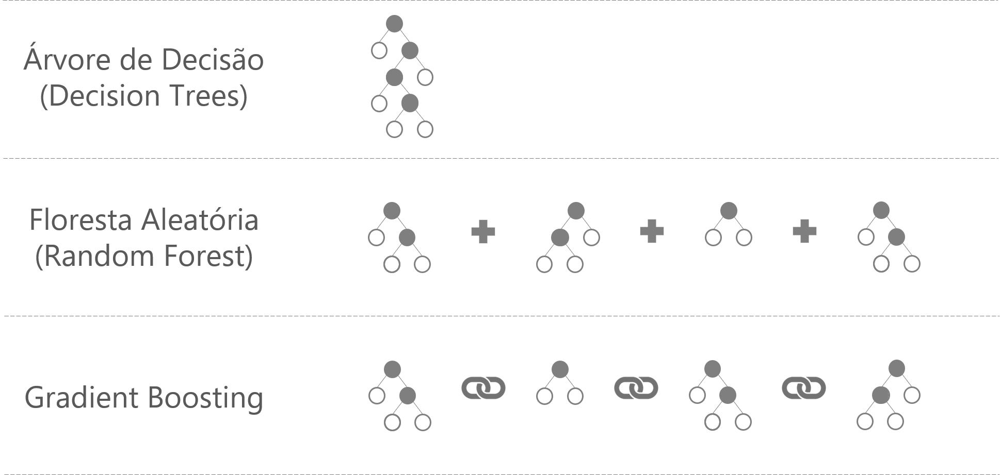

---

# No R

.pull-left[

```{r, eval=FALSE}
# árvore de decisão
modelo_tree <- decision_tree(
  min_n = tune(),
  tree_depth = tune(),
  cost_complexity = tune() 
)
```

```{r, eval=FALSE}
# Random Forest
modelo_rf <- rand_forest(
  min_n = tune(),
  mtry = tune(),
  trees = tune()
)
```

]

.pull-right[


```{r, eval=FALSE}
# XGBoost
modelo_xgb <- boost_tree(
  min_n = tune(),
  mtry = tune(),
  trees = tune(),
  tree_depth = tune(),
  learn_rate = tune(),
  loss_reduction = tune(),
  sample_size = tune() 
)
```


]

---


# Referências

.pull-left[
<a href = "https://web.stanford.edu/~hastie/Papers/ESLII.pdf">
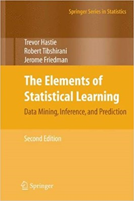</img>
</a>
]

.pull-right[
<a href = "http://faculty.marshall.usc.edu/gareth-james/ISL/ISLR%20Seventh%20Printing.pdf">
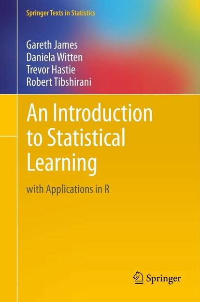</img>
</a>
]

---

class: inverse, center, middle

# Árvore de Decisão

---

# Árvore de Decisão

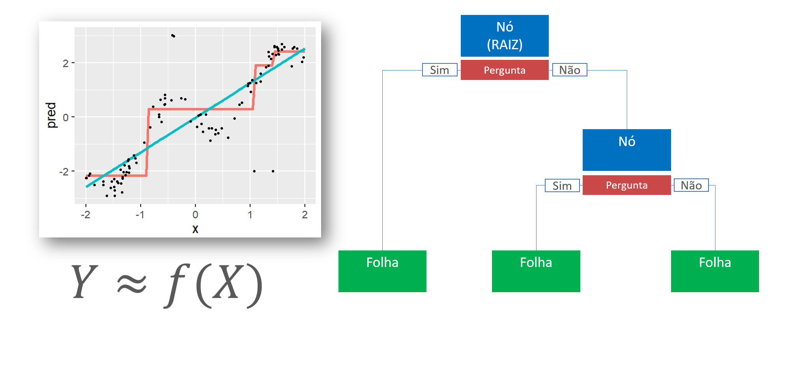

---

# Árvore de Decisão

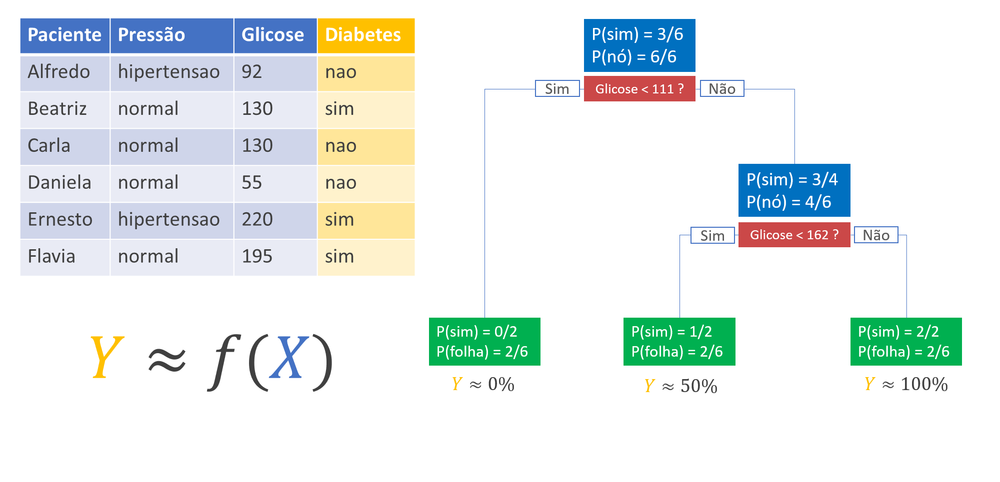

---

# Árvore de Decisão

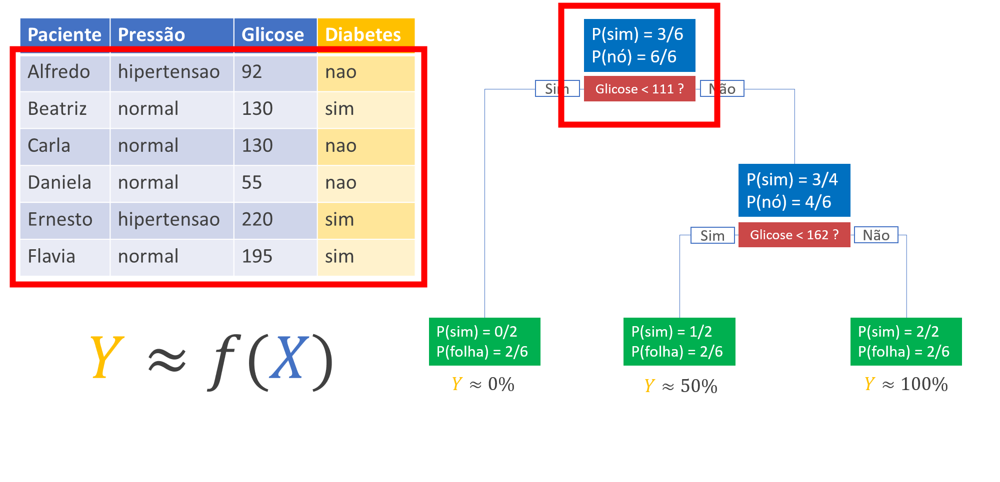

---

# Árvore de Decisão

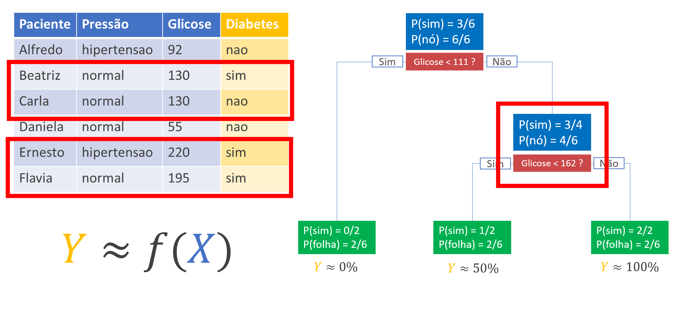

---

# Árvore de Decisão

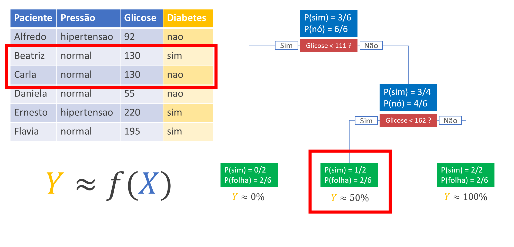

---

# Árvore de Decisão

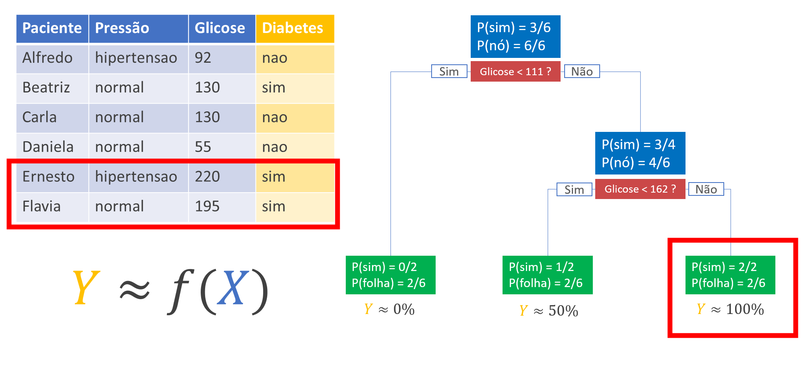

---

# Árvore de Decisão

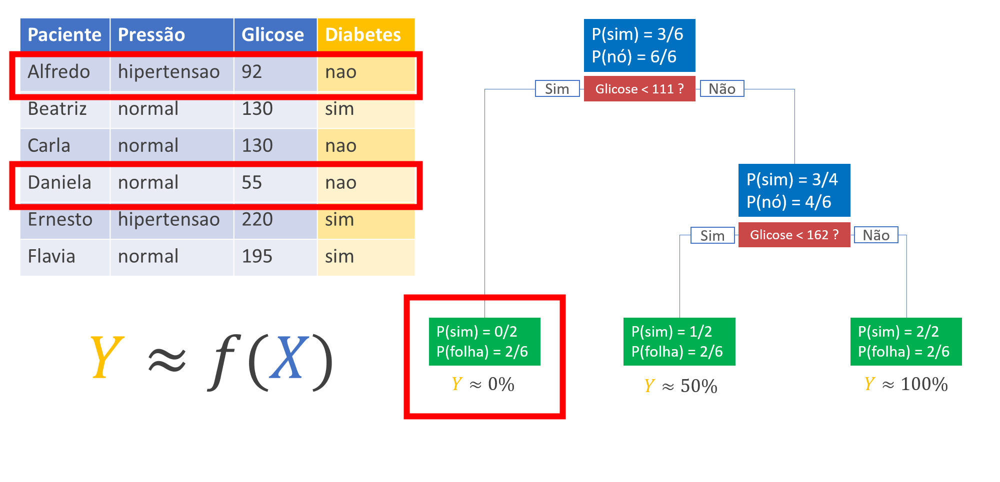

---

# Árvore de Decisão - Perguntas

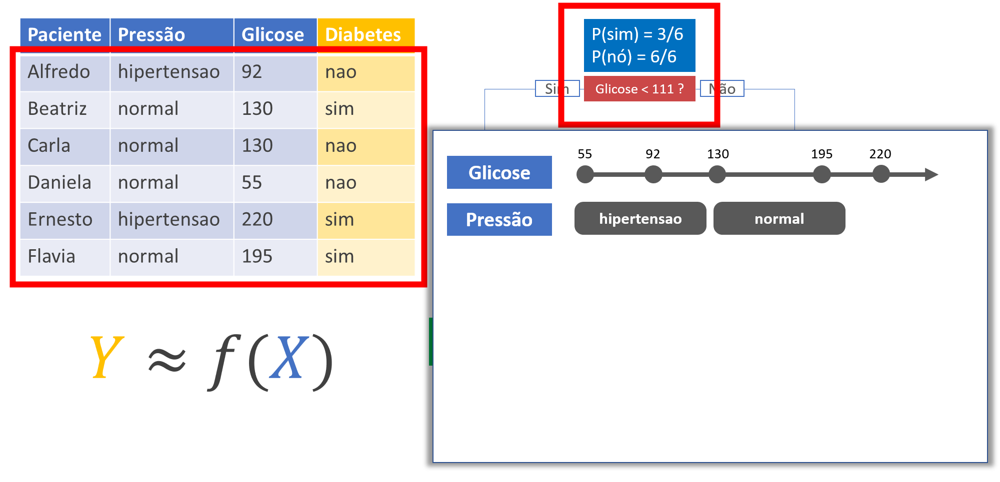

---

# Árvore de Decisão - Perguntas

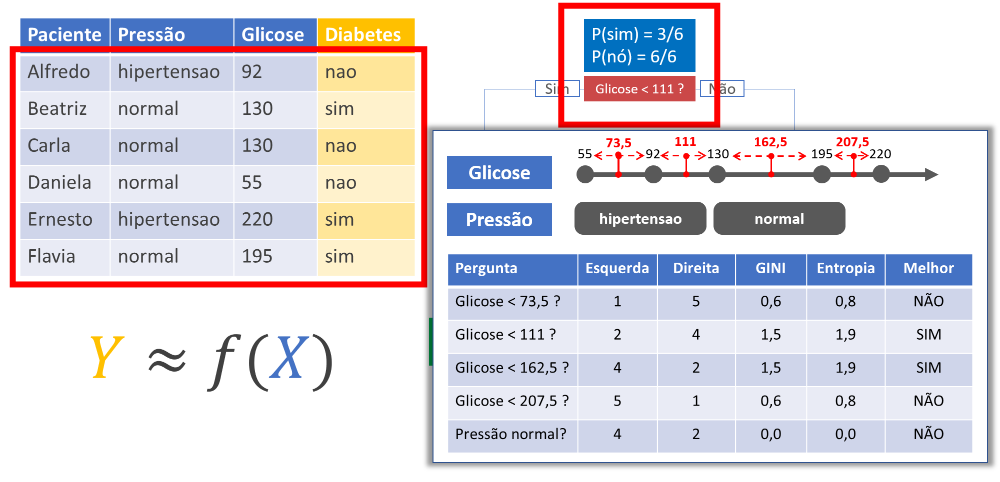

---

# Árvore de Decisão - Impureza e Ganho de Informação

### Ganho de Informação (information gain)

$$
\mbox{GI} = N . Imp(nó) - N(esq) . Imp(esq) - N(dir) . Imp(dir)
$$

### Medidas de Impureza mais comuns

.center[
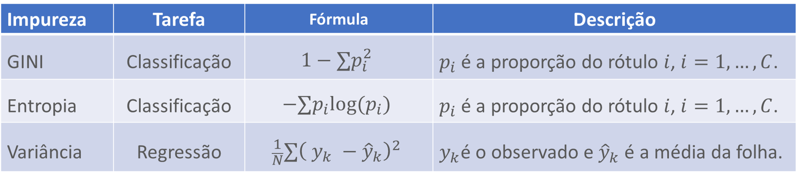
]

.footnote[
Fonte: [spark.apache.org/docs/1.3.0/mllib-decision-tree.html]()
]


---

# Árvore de Decisão - Impureza e Ganho de Informação

### Exemplo usando o GINI


.center[
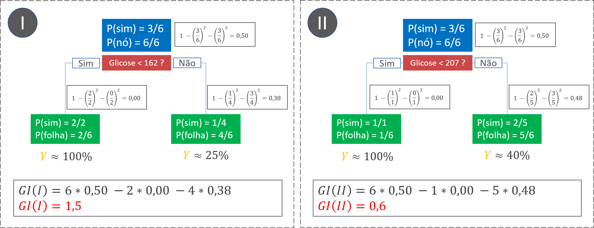
]


---

# Árvore de Decisão - Hiperparâmetros e Overfitting

.pull-left[

**min_n** - Quantidade mínima de observações dentro de um nó para se considerar dividir em duas folhas novas. Quanto menor, maior risco de overfitting.

.cinza[**tree_depth** - Profundidade: quanto mais profunda a árvore for, maior risco de overfitting.]

.cinza[**cost_complexity** - Parâmetro de complexidade: limite mínimo de ganho de informação que a divisão tem que fornecer para concretizar a criação das folhas.]

]


.pull-right[

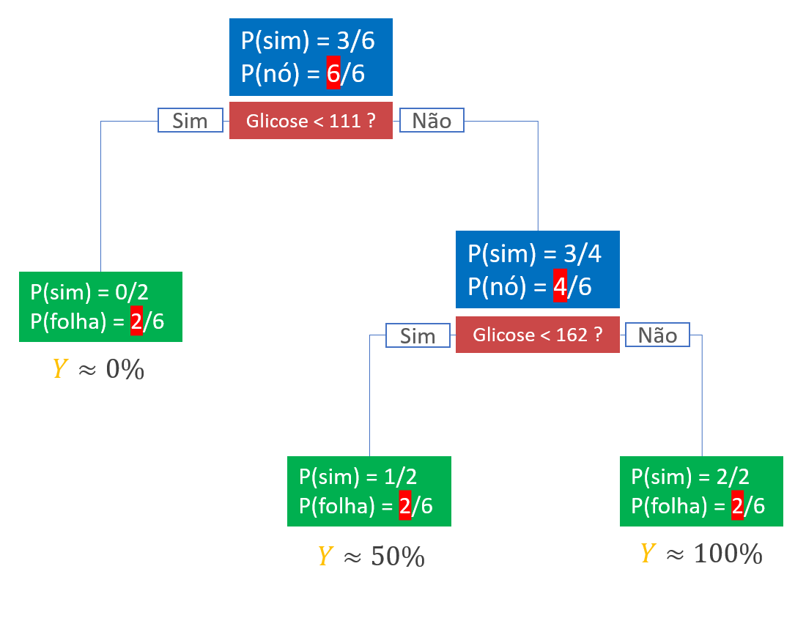

]


---

# Árvore de Decisão - Hiperparâmetros e Overfitting

.pull-left[

.cinza[**min_n** - Quantidade mínima de observações dentro de um nó para se considerar dividir em duas folhas novas. Quanto menor, maior risco de overfitting.]

**tree_depth** - Profundidade: quanto mais profunda a árvore for, maior risco de overfitting.

.cinza[**cost_complexity** - Parâmetro de complexidade: limite mínimo de ganho de informação que a divisão tem que fornecer para concretizar a criação das folhas.]

]


.pull-right[

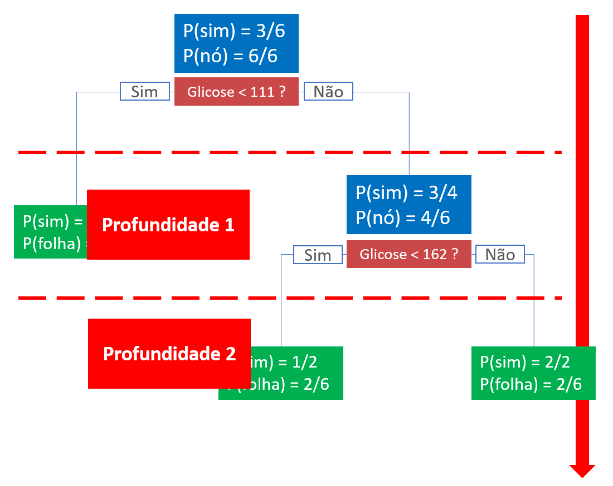

]


---

# Árvore de Decisão - Hiperparâmetros e Overfitting

.pull-left[

.cinza[**min_n** - Quantidade mínima de observações dentro de um nó para se considerar dividir em duas folhas novas. Quanto menor, maior risco de overfitting.]

.cinza[**tree_depth** - Profundidade: quanto mais profunda a árvore for, maior risco de overfitting.]

**cost_complexity** - Parâmetro de complexidade: limite mínimo de ganho de informação que a divisão tem que fornecer para concretizar a criação das folhas.

]


.pull-right[

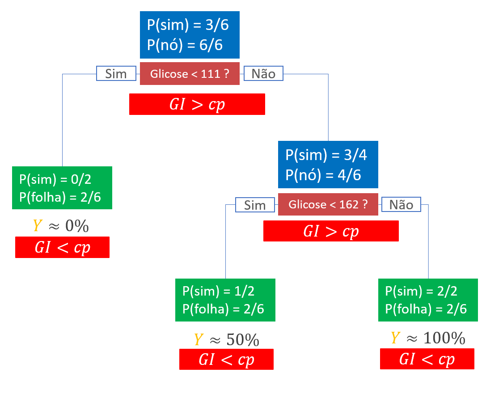

]

---

# Árvore de Decisão - Cost Complexity 

.pull-left[

$$
R_{cp} = R(T) + cp*|T|
$$

- Quanto maior o CP, menos quebras a árvore vai ter.

- Selecionamos o tamanho de árvore ideal variando o CP (por meio de cross-validation).

- Sugere-se progressão geométrica da grade de valores. 

  Exemplo: $10^{-5}, 10^{-4}, 10^{-3}, 10^{-2}, 10^{-1}$ 
  
  (o `tune()` já está programado para isso).


]

.pull-right[


```{r, echo=FALSE, warning=FALSE, fig.height=6, cache=TRUE}
dados <- tibble(
  x = runif(1300),
  y = -10*x + 12.5*x^2 + rnorm(1300)
)
set.seed(1)
modelo <- decision_tree(cost_complexity = tune(), tree_depth = 16, min_n = 20) %>%
  set_engine("rpart") %>% 
  set_mode("regression")

params <- parameters(modelo) %>%
  update(cost_complexity = cost_complexity(c(-3.5, -1))) %>%
  grid_regular(levels = 20)

ajuste <- tune_grid(
  y ~ x, 
  modelo, 
  resamples = vfold_cv(dados, 5),
  grid = params,
  metrics = metric_set(rmse)
)

collect_metrics(ajuste) %>%
  ggplot(aes(x = cost_complexity, y = mean)) +
  geom_point() +
  geom_errorbar(aes(ymin = mean - std_err, ymax = mean + std_err)) +
  facet_wrap(~.metric, scales = "free") +
  scale_x_log10()
```


]

---

# Árvore de Decisão

.pull-left[

- O exemplo foi dado com variável resposta (diabetes) de apenas duas classes, SIM e NÃO, mas poderia ter três ou mais. 

- A variável explicativa hipertensão apresentava apenas duas classes também, mas poderia apresentar mais. Nesse caso, os algoritmos de árvores têm de decidir como fazer as PERGUNTAS. Esse [link da Freakonometrics](https://freakonometrics.hypotheses.org/20736) apresenta a heurística mais utilizada nesse caso.

- As figuras são representações diferentes para um mesmo modelo de árvore. As regiões $R_1, R_2, \dots$ correspondem às folhas da árvore.

]

.pull-right[
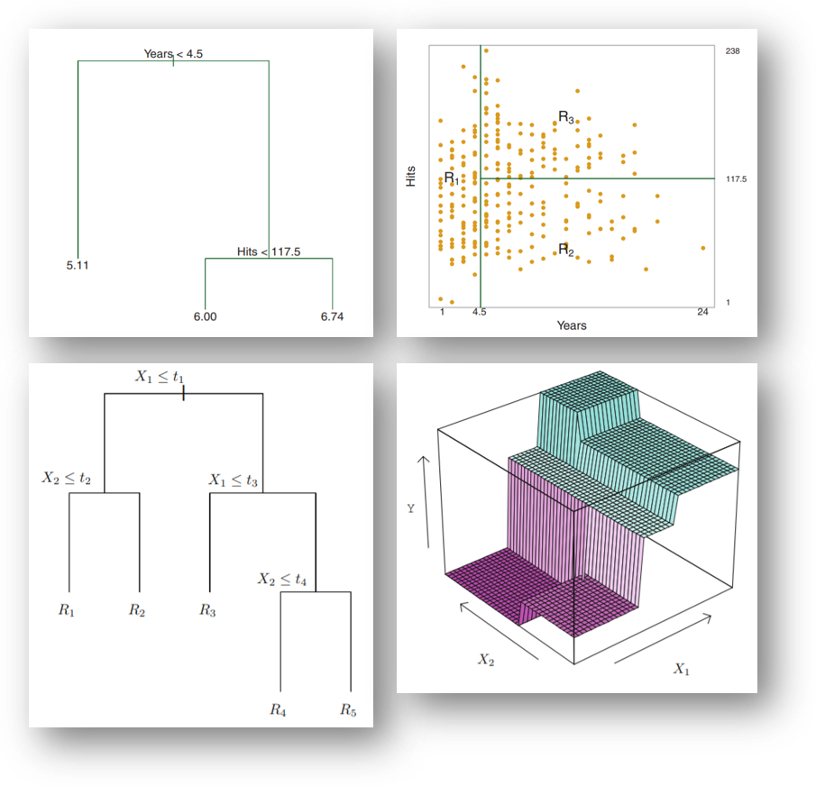

]


.footnote[
Ver [ISL](https://www.ime.unicamp.br/~dias/Intoduction%20to%20Statistical%20Learning.pdf) página 305 (Tree-based Methods).
]

---

class: inverse, center, middle

# Random Forest

---

# Relação Viés-Variância (Bias-variance tradeoff)

.pull-left[

#### Erro de Predição Esperado

$$\small\color{#AB2729}{\mbox{}\mbox{E} [(Y - \hat{f}(x_o))^2]}  = \\ \\ \small\color{#AB2729}{\mbox{E}[(f(x_o) +\epsilon - \hat{f}(x_o))^2]} = \\\\ \small\color{#7CD5D5}{(\mbox{E}\hat{f}(x_o) - f(x_o))^2} + \color{#F49135}{\mbox{E}[(\hat{f}(x_o) - \mbox{E}\hat{f}(x_o))^2]} + \color{LimeGreen}{Var(\epsilon)}  = \\\\\small \color{#7CD5D5}{Viés^2} + \color{#F49135}{Variância} + \color{LimeGreen}{Erro\ Irredutível}$$

<br/> 

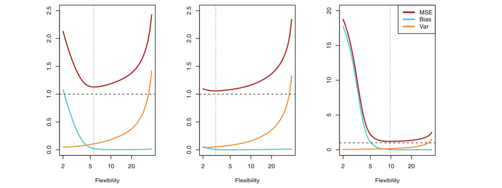


]


.pull-right[
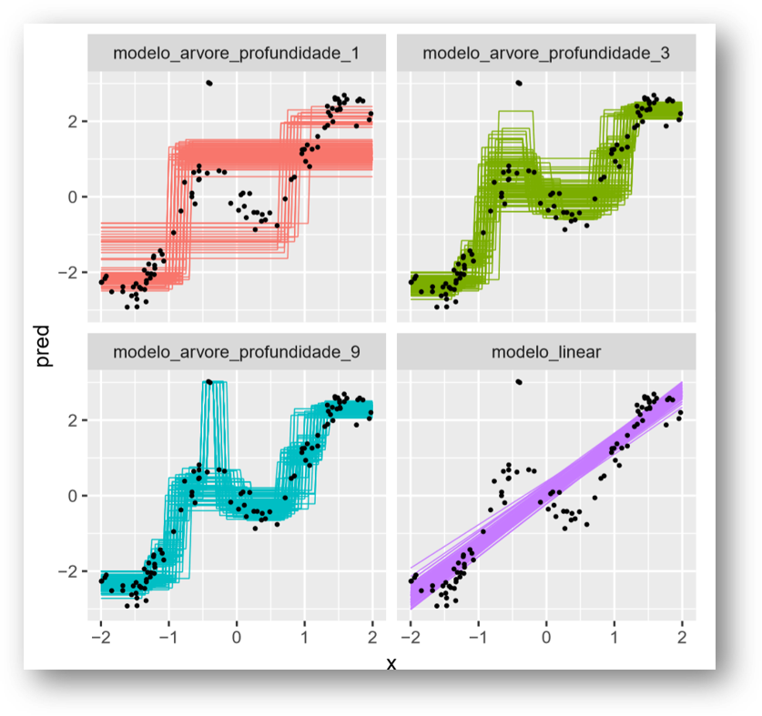

]


.footnote[
Ver [ISL](https://www.ime.unicamp.br/~dias/Intoduction%20to%20Statistical%20Learning.pdf) página 33 (The Bias-Variance Trade-Off).
]


---

# Relação Viés-Variância (Bias-variance tradeoff)

.pull-left[

#### Erro de Predição Esperado

$$\small\color{#AB2729}{\mbox{}\mbox{E} [(Y - \hat{f}(x_o))^2]}  = \\ \\ \small\color{#AB2729}{\mbox{E}[(f(x_o) +\epsilon - \hat{f}(x_o))^2]} = \\\\ \small\color{#7CD5D5}{(\mbox{E}\hat{f}(x_o) - f(x_o))^2} + \color{#F49135}{\mbox{E}[(\hat{f}(x_o) - \mbox{E}\hat{f}(x_o))^2]} + \color{LimeGreen}{Var(\epsilon)}  = \\\\\small \color{#7CD5D5}{Viés^2} + \color{#F49135}{Variância} + \color{LimeGreen}{Erro\ Irredutível}$$

<br/> 


]


.pull-right[
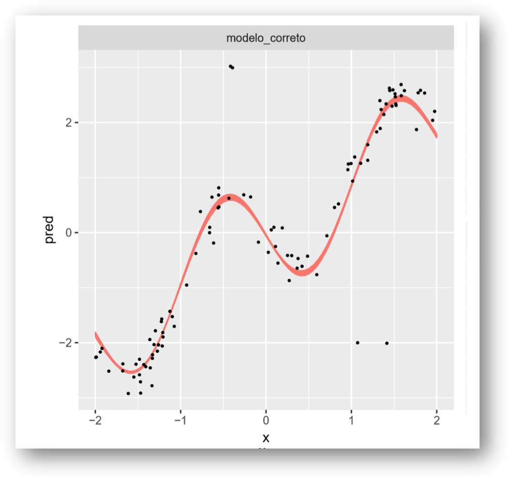

]


.footnote[
Ver [ISL](https://www.ime.unicamp.br/~dias/Intoduction%20to%20Statistical%20Learning.pdf) página 33 (The Bias-Variance Trade-Off).
]

---

# Random Forest

.pull-left-maior[

- **Random Forest** é a combinação de “palpites” de um monte de árvores de decisão. É um algoritmo de uma classe especial de ENSEMBLE: BAGGING.
- **ENSEMBLE**: mistura de 2 ou mais modelos. ([ESL](https://web.stanford.edu/~hastie/Papers/ESLII.pdf) p 605)
- **BAGGING**: Bootstrap AGGregation. ([ESL](https://web.stanford.edu/~hastie/Papers/ESLII.pdf) p 282) 
- Diferença para os **BAGGINGs**: Sorteia as colunas também.

#### Algoritmo

1. Sorteie **B** conjuntos de observações da base **D**
2. Para cada conjunto $b$ de **B**, sorteie $m$ variáveis de **D**
3. Para cada uma das **B** sub-bases geradas por $(b, m)$ construa uma árvore de decisão
4. Para previsão final, agregue as previsões individuais de cada uma das **B** árvore.

]

.pull-right-menor[
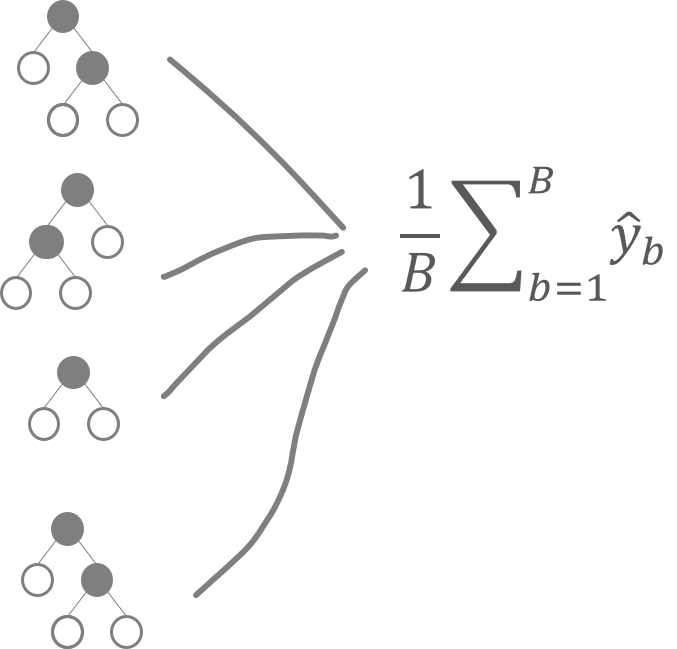


]

---

# Random Forest - Hiperparâmetros e Overfitting

.pull-left[

**min_n** – Qtd mínima de observações no nó para poder dividir.

**mtry** – Quantidade de variáveis (colunas) sorteadas por árvore. Tem que testar via cross-validation, pois é afetado pela razão entre variáveis boas e ruído.

**trees** – Número de árvores (amostras bootstrap) para treinar. Não afeta muito o overfitting.

]

.pull-right[


]

**PS:** random forest não usa CP. Ele permite que as árvores cresçam indeterminadamente, condicionadas apenas pelo **min_n**.

.footnote[
Ver [ISL](https://www.ime.unicamp.br/~dias/Intoduction%20to%20Statistical%20Learning.pdf) página 319 (Random Forest).
]

---

class: inverse, middle, center

# Gradient Boosting


---

# Gradient Boosting

- *Boosting* também é a combinação de “palpites” de um monte de árvores de decisão.

- Porém, não existe amostras *bootstrap* dentro do algoritmo, as árvores são construídas sequencialmente (cada árvore é construída usando informação da árvore passada).

**Forward Stagewise Algorithm (coração do gradient boost)**

.pull-left[

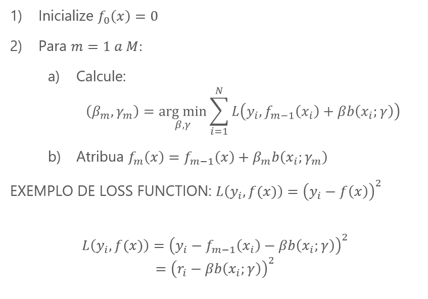

]

.pull-right[

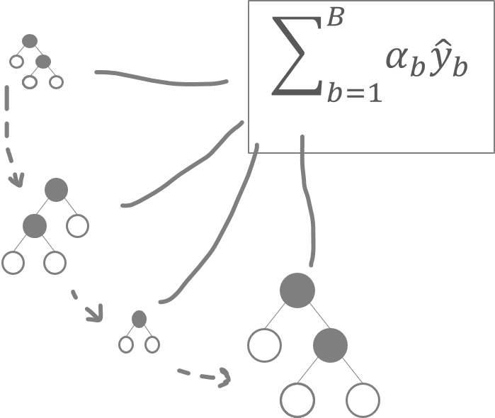

]

.footnote[
Ver [ESL](https://web.stanford.edu/~hastie/Papers/ESLII.pdf) página 341 (Gradient Boosting).
]


---

# Gradient Boosting

- *Boosting* também é a combinação de “palpites” de um monte de árvores de decisão.

- Porém, não existe amostras *bootstrap* dentro do algoritmo, as árvores são construídas sequencialmente (cada árvore é construída usando informação da árvore passada).

**Adaboost (versão para classificação binária)**
.pull-left[

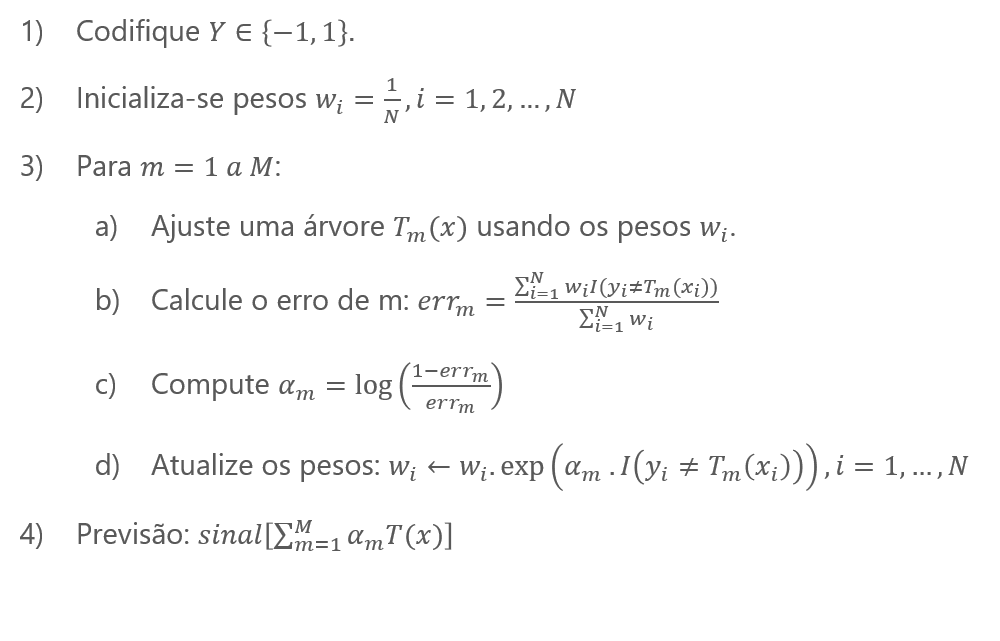

]

.pull-right[


]

.footnote[
Ver [ESL](https://web.stanford.edu/~hastie/Papers/ESLII.pdf) página 341 (Gradient Boosting).
]

---

class: inverse, middle, center

# XGBoost

---

#XGBoost

.pull-left[

- XGBoost é uma implementação melhorada do Gradient Boost.

- O XGBoost traz de volta reamostragem e hiperparâmetros de regularização.

- Top 2 de Algoritmos que mais ganharam Kaggle.

]

.pull-right[

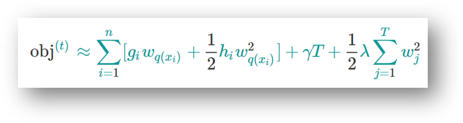
]

.pull-left[


**min_n** – Qtd mínima de observações no nó para poder dividir.

**mtry** – Quantidade de variáveis sorteadas por árvore. Tem que testar via CV, pois é afetado pela razão entre variáveis boas e ruído.

**trees** – Número de árvores (de passos).


]

.pull-right-abaixo[

**tree_depth** – Profundidade máxima da árvore.

**learn_rate** – Tamanho do "passo". Quanto menor, mais devagar. PS: Aumentar o número de árvores junto!

**loss_reduction** – Parâmetro regularizador. Análogo ao CP do `rpart`.

**sample_size** – Proporção de linhas para sortear por árvore.

]


.footnote[
Ver [Introduction to Boosted Trees](https://xgboost.readthedocs.io/en/latest/tutorials/model.html) do XGboost.io.
]

---

# Sobre os problemas nos dados

- XGBoost trata missing automaticamente dentro dele, não precisa tratar. Porém, sempre vale técnicas de imputação para tentar aprimorar o modelo!

- Multicolinearidade não é um problema grave para modelos de árvore. Mas é sempre bom filtrar variáveis explicativas muito correlacionadas. [Ler esse post para exemplo.](https://www.curso-r.com/blog/2018-05-22-arvore-e-multicolinearidade/)

- Variável resposta precisa ir como factor. Não pode ser character nem 0/1.

- As variáveis categóricas precisam ser "dummyficadas" antes.

- A escala das variáveis explicativas não atrapalham modelos de árvores.

- A assimetria das variáveis explicativas não atrapalham modelos de árvores.


---

#XGboost - Intuição dos hiperparâmetros


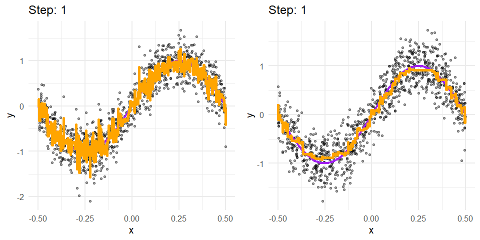


---

#XGboost - Intuição dos hiperparâmetros

.pull-left[
```{r}
modelo <- boost_tree(
  mtry = 1, 
  trees = 100, 
  min_n = 1, 
  tree_depth = 1, 
  learn_rate = 1,
  sample_size = 1, 
  loss_reduction = 1
)
```
]

.pull-right[


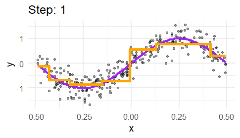


]

.pull-left[

```{r}
modelo <- boost_tree(
  mtry = 1, 
  trees = 100, 
  min_n = 1, 
  tree_depth = 2, #<<
  learn_rate = 1,
  sample_size = 1, 
  loss_reduction = 1
)
```

]

.pull-right-abaixo[

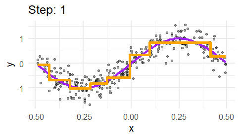

]

---

#XGboost - Intuição dos hiperparâmetros

.pull-left[
```{r}
modelo <- boost_tree(
  mtry = 1, 
  trees = 100, 
  min_n = 1, 
  tree_depth = 1, 
  learn_rate = 0.1, #<<
  sample_size = 1, 
  loss_reduction = 1
)
```
]

.pull-right[


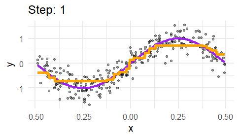


]

.pull-left[

```{r}
modelo <- boost_tree(
  mtry = 1, 
  trees = 100, 
  min_n = 1, 
  tree_depth = 1, 
  learn_rate = 1,
  sample_size = 0.5, #<<
  loss_reduction = 1
)
```

]

.pull-right-abaixo[

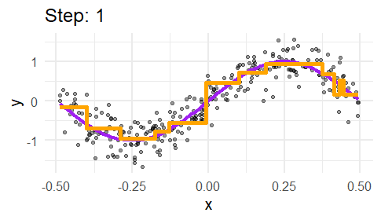

]


---

#XGboost - Intuição dos hiperparâmetros

.pull-left[
```{r}
modelo <- boost_tree(
  mtry = 1, 
  trees = 100, 
  min_n = 1, 
  tree_depth = 1, 
  learn_rate = 1, 
  sample_size = 1, 
  loss_reduction = 0.1 #<<
)
```
]

.pull-right[


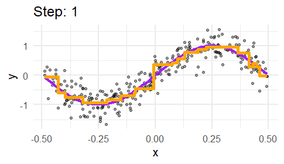


]

.pull-left[

```{r}
modelo <- boost_tree(
  mtry = 1, 
  trees = 100, 
  min_n = 1,  
  tree_depth = 2, #<<
  learn_rate = 0.1, #<<
  sample_size = 0.5, #<<
  loss_reduction = 0.1 #<<
)
```

]

.pull-right-abaixo[


]


---

# Extrapolação dos modelos de árvores

```{r, echo=FALSE, fig.asp=0.5, fig.width=14}
set.seed(1)
dados <- tibble(
  x = runif(200) - 0.5,
  y = sin(x * pi * 2) + rnorm(200, sd = 0.3)
)

modelo <- boost_tree(
  mode = "regression", 
  mtry = 1, 
  trees = 250, 
  min_n = 2, 
  tree_depth = 5, 
  learn_rate = 0.1, 
  sample_size = 0.9, 
  loss_reduction = 0.9
) %>%
  set_engine("xgboost", base_score = 0)

ajuste <- fit(modelo, y ~ x, data = dados)

dados_xgb <- dados %>% select(x) %>% as.matrix()


dados_extr <- tibble(x = seq(-1, 1, length.out = 1000)) 
dados_xgb_extr <- dados_extr %>% select(x) %>% as.matrix()
dados_extr <- dados_extr %>%
  mutate(
    pred = xgboost:::predict.xgb.Booster(ajuste$fit, newdata = dados_xgb_extr, ntreelimit = 0)
  )

dados %>%
  mutate(
    pred = xgboost:::predict.xgb.Booster(ajuste$fit, newdata = dados_xgb, ntreelimit = 0)
  ) %>%
  ggplot(aes(x = x)) +
  geom_point(aes(y = y), size = 2, alpha = 0.4) +
  stat_function(fun = ~sin(. * pi * 2), colour = "purple", size = 1.5) +
  geom_step(aes(y = pred), colour = "orange", size = 2) +
  geom_step(aes(y = pred), colour = "orange", size = 2, linetype = "dashed", data = dados_extr) +
  theme_minimal(30)
```


---

# No R

.pull-left[

```{r, eval=FALSE}
# árvore de decisão
modelo_tree <- decision_tree(
  min_n = tune(),
  tree_depth = tune(),
  cost_complexity = tune() 
)
```

```{r, eval=FALSE}
# Random Forest
modelo_rf <- rand_forest(
  min_n = tune(),
  mtry = tune(),
  trees = tune()
)
```

]

.pull-right[


```{r, eval=FALSE}
# XGBoost
modelo_xgb <- boost_tree(
  min_n = tune(),
  mtry = tune(),
  trees = tune(),
  tree_depth = tune(),
  learn_rate = tune(),
  loss_reduction = tune(),
  sample_size = tune() 
)
```

]

